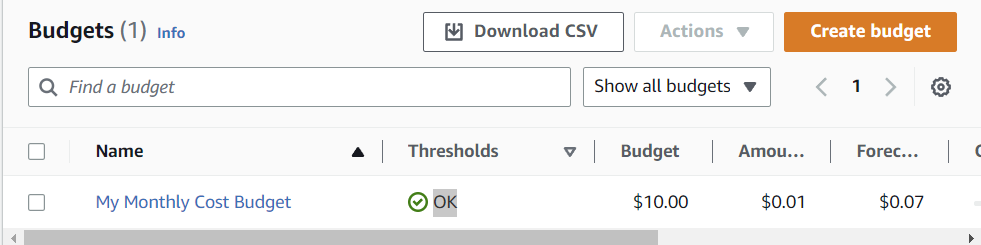
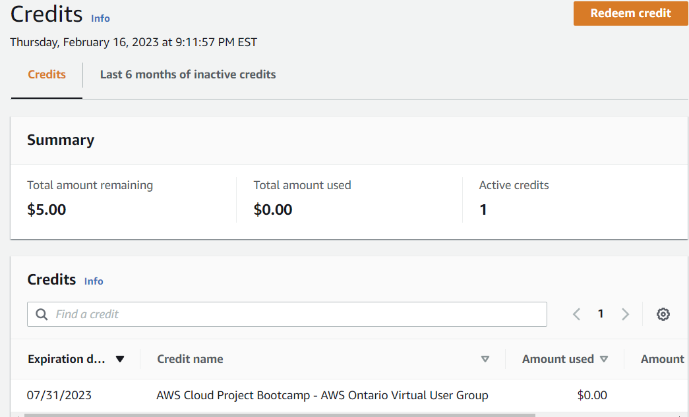
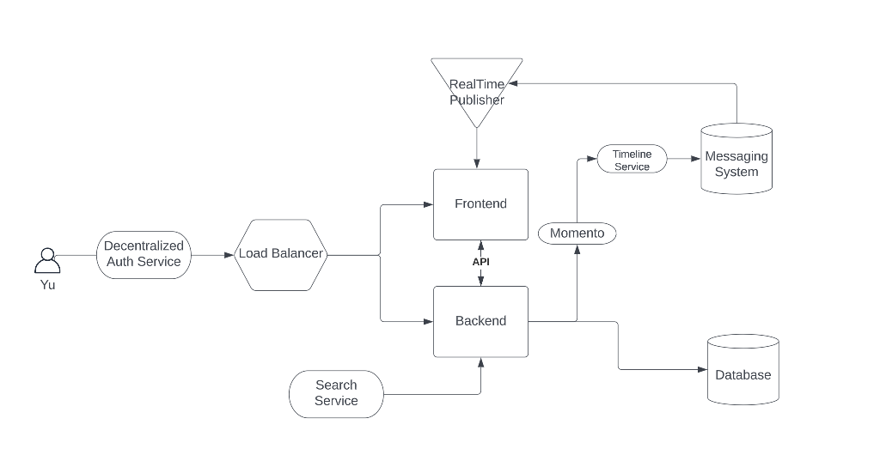
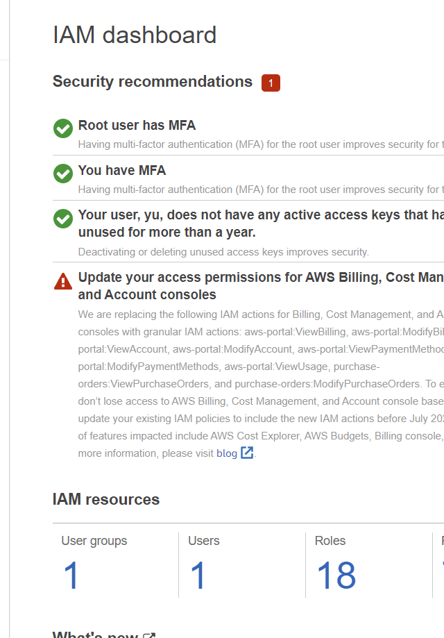
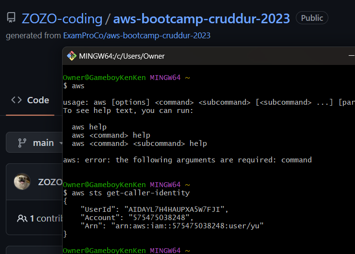
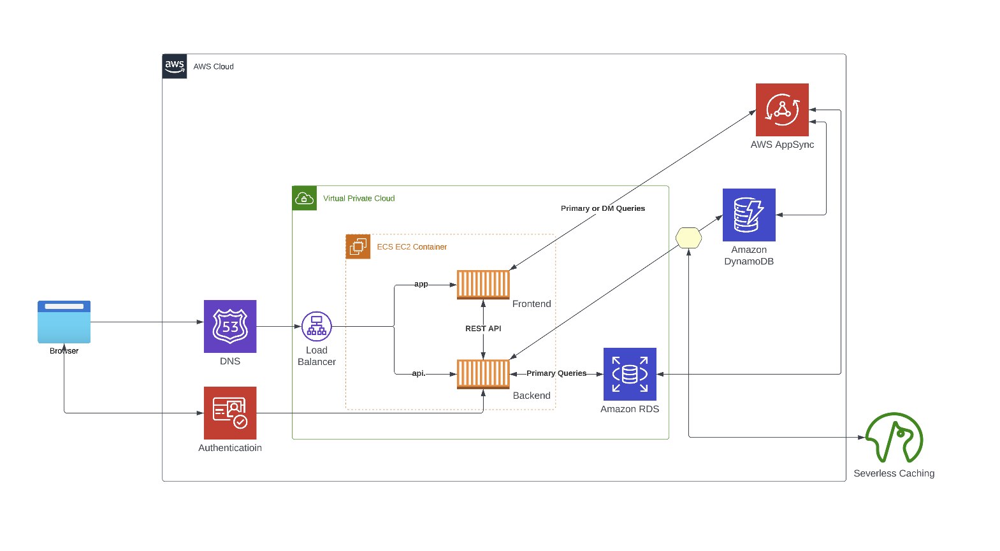

# Week 0 — Billing and Architecture
# Week 0 Journal

The format of this journal is based on the tutorial videos uploaded for this boot camp every week, I’ve listed the topics as well as what I have learned in bulletin points.

# Pricing Basics and Free Tier (demo walkthrough)

- AWS Bill Walkthrough (Free tier)
    - Pricing will depend on the region you select
    - IAM users will need authorization from the root user for billing accessibility
- Billing Alert (CloudWatch Alarm & Budget)
    - Old method: “manage billing alerts” from “billing preferences” —> CloudWatch —> setting alarms
    - New method: “cost management” —> “budget”
        - The advantage of using budget is we get to receive notice when our spend reaches 85%, 100%, and over 100% of our budget.
        
        
        
- Cost Explorer
    - Advanced feature
    - Generate reports
- Calculate AWS estimates cost for service
    - Example shown: ec2 pricing — on-demand pricing — get the price per hour and times the hours per month (720 or 744 hours)
    - AWS calculator - a bit different than using a calculator (730 hours)
- Check AWS Credits (voucher)
    
    
    
- Cost allocation tags
- Free forever vs Free for 12 months
    - identify what service falls into “free forever” and “free 12month” and “trial”

# ****Generate Credentials, AWS CLI, Budget, and Billing Alarm via CLI****

- Homework (Napkin and Architectural diagrams)
    
     https://lucid.app/lucidchart/11ccef8b-c41e-4719-ab3c-f989960c7ec4/edit?viewport_loc=-660%2C-53%2C3015%2C1488%2C0_0&invitationId=inv_b614bb90-1963-482c-a8f0-98f60b92c763
    
    
    
- Setting up your Budgets and alarms
    - zero budget
    - monthly/daily budget
    - cost budget and also usage budget (for example, EC2 usage)
    - set multiple thresholds
- Setting up your Root account and Admin user
    
    
    
- Creating access keys for Admin user
- Launching Cloudshell
    - auto prompt aws
    - CLI documentation: [link](https://awscli.amazonaws.com/v2/documentation/api/latest/reference/index.html)
- Gitpod configuration (AWS Credentials, AWS CLI)
    - install AWS CLI on gitpod
- Proof of AWS CLI
    
    
    

# ****AWS Organizations & AWS IAM Tutorial****

- Cloud Security Goal in an Organization?
    - Identify and inform the business on any Technical Risk that the business maybe exposed to.
    - Type of OU (organization unit)
        - Business units: engineering, finance, etc.
        - Active Account & Standby Account (move standby accounts to active accounts, maybe through automation)
    - Management Account
- What is Cloud Security?
    - protects the data, application, and service with Cloud
- Why care about Cloud Security?
    - reduce impact of breach
    - protection: networks, applications, services in cloud  <— data theft
    - human error —> data leaks
- Why Cloud Security requires Practice?
    - complexity
    - new services anounced
    - hackers are improving!
- Why Enable AWS IAM User MFA?
    - “root user” — the most powerful user in your AWS environment
- AWS CloudTrail Explained & Why do you need it?
    - monitor data security
    - audit logs
    - region vs. az vs. global service
    - stored in s3 bucket
- AWS IAM User Explained
    - principle of least previlege
    - global service
- AWS IAM Role Explained
    - 2 types of IAM roles and IAM policies:
        - provided by amazon
        - IAM
    - Roles: permission
    - Policies: can be attached to groups of users / roles
- AWS Organization SCP Explained
    - service control policy
    - shared responsibility
    - region vs. az vs. global service
- TOP 5 AWS SECURITY BEST PRACTICES
    - data protection & residency
    - IAM with the least privilege
    - governance & compliance of AWS services
        - global vs region
        - complaint services
    - shared responsibility
    - incident response plans

# ****Lucid Charts - Cruddur Logical Diagram****

[https://lucid.app/lucidchart/f709c082-5e56-4760-8643-8228bb8cab1c/edit?view_items=FSWxa-oKW-bM&invitationId=inv_c3a56080-beff-4645-b1f0-3e41348d5a1e](https://lucid.app/lucidchart/f709c082-5e56-4760-8643-8228bb8cab1c/edit?view_items=FSWxa-oKW-bM&invitationId=inv_c3a56080-beff-4645-b1f0-3e41348d5a1e)

