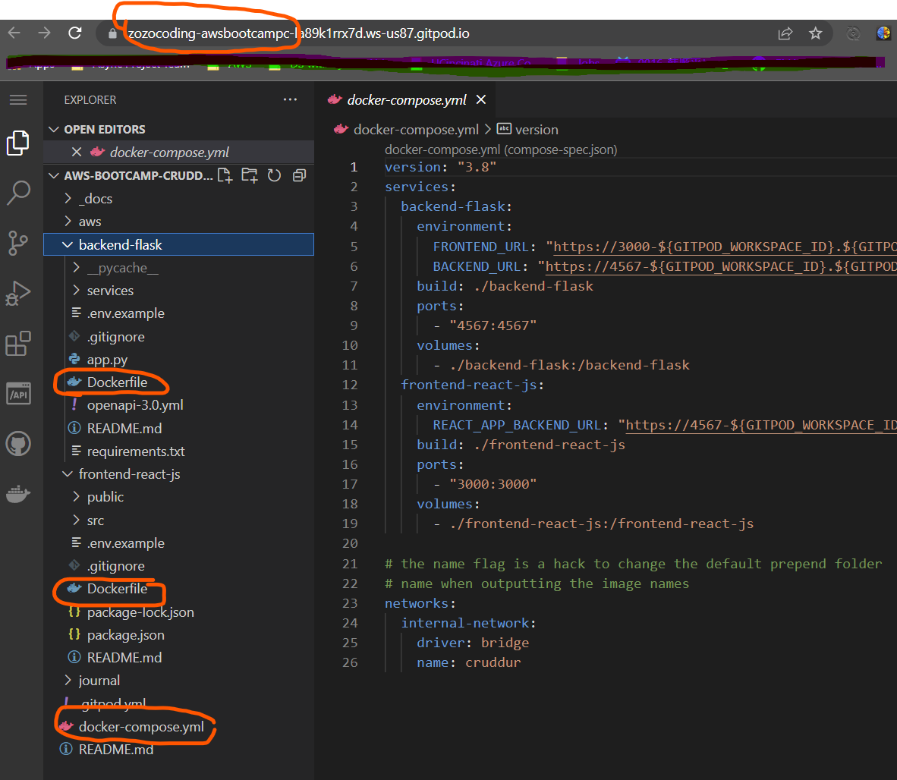
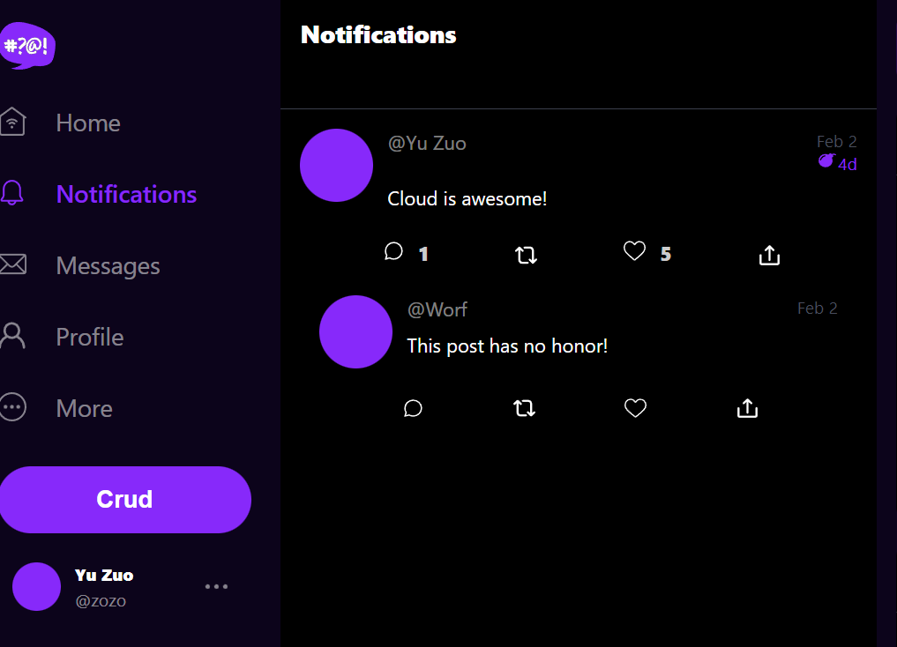
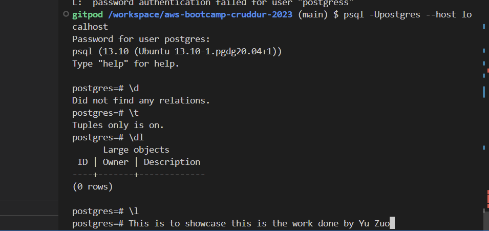
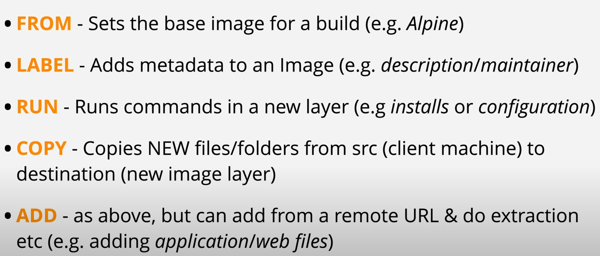
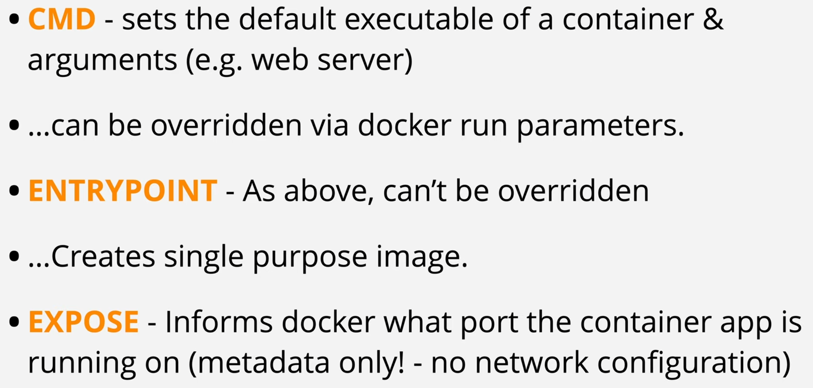
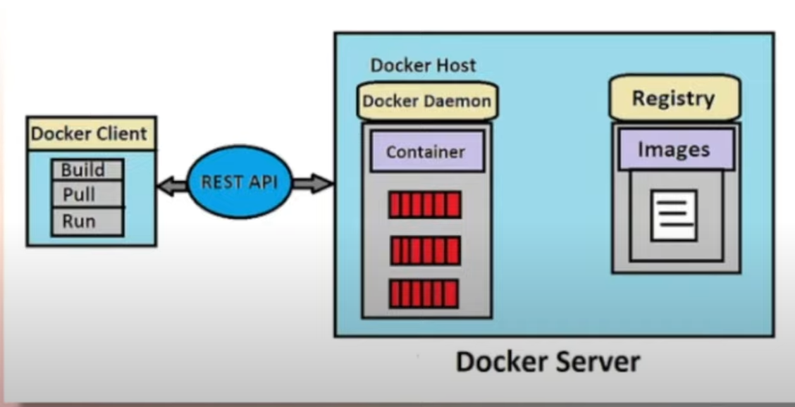

# Week 1 — App Containerization

# Week 1 Journal

The format of the journal is sectioned by the tutorial videos on the YouTube channel, I will list out the topics, and below each topic, I will have bulletin points to mark down all the content, as well as my notes & interpretation.

 

## Andrew’s Session: App Containerization + 2 Supplement Videos

1. Followed a long all steps to build images and run frontend and backend in containers.
    
    
    
2. As a Docker beginner, I also watch the Docker tutorial from LeanCantrill at: [https://www.youtube.com/playlist?list=PLTk5ZYSbd9Mg51szw21_75Hs1xUpGObDm](https://www.youtube.com/playlist?list=PLTk5ZYSbd9Mg51szw21_75Hs1xUpGObDm)
3. I followed along the video to implement the notifications page backend and frontend, I’m not very familiar with Flask syntax, but with my knowledge in Node and Express, it is relatively intuitive to understand. See below screenshot for proof of work:
    
    
    
4. I followed along the video to install DynamoDB and Postgres:
    
    
    

## Docker Tutorial (LearnCantrill YouTube Channel)

- Physical host vs. Virtual Machines vs. Containers
    - Physical host has low fault tolerance, when host is down, any service running on that host are down too.
    - We can run multiple VMs on a physical host, each VM has its own operating system.
    - Container is more lightweight than VM, and does not need to configure operating system.
- Docker Architecture: Docker Client (CLI, Docker Desktop) — Docker Host (Containers, Images) — Registry (Hub)
- Docker Images are immutable, read-only, every container that uses the image, will have a layer of operations marked to make that container distinguishable to other containers.
- To download an image from the DockerHub, the command is `docker pull image-name`, or to download is run the container with that image, you can do `docker run image-name`, that way the Docker Host will download the image first (if the image is not yet in your machine), and run it.
- To create a Docker image through Dockerfile:
    - Dockerfile is just a set of instructions, best practice to write in all CAPS
    - Typical instructions (screenshot from the tutorial):
        
        
        
        
        
- Successfully built 2 containers using the tutorial repo and Dockerfile.
    - There are 3 flags I need to study more, those flags are used in the `docker build` command:
        - -p: mapping the port
        - -d: detach
        - -t: tag
- To clean up the containers, run `docker stop containerId` and `docker rm containerId`
- Docker container storage
    - Writable layer: data were overwritten, new data
- Environment variables
    - syntax: `-e PASSWORD=xxxx`
- Docker Compose
    - Used to create, manage and cleanup multi-container applications

## Docker Container Security Best Practices

- Container Security Explained
    - Container Security is the practice of protecting your applications hosted on computing services like Containers. Common examples of applications can be:
        - Single Page Applications (SPAs)
        - Microservices
        - APIs
    - Can be inside or outside of the cloud
- Why is Docker Container Popular?
    - Container First Strategy
    - Most applications are being developed with Containers and Cloud Native
    - Reducing the impact of the breach
    - More focus on security responsibility (AWS ECS, AWS ECR, etc)
- Docker Architecture | Components
    
    
    
- Docker Security Components
    - Docker & Host Configuration
    - Securing Images
    - Secrete Management
    - Application Security
    - Data Security
    - Monitoring Containers
    - Compliance Framework
- Container Security Best Practices
- Docker Compose Explained
- Snyk Open Source Github Walkthrough
- AWS Secret Manager Explained
- Hashicorp Valut
- AWS Secret Manager Tutorial
- AWS Inspector Explained
- AWS Inspector Tutorial
- AMI Scanning with Inspector
- Snyk Container Scanning
- Docker Compose Example Tutorial
- Snyk Container Security
- Bonus Docker Security Tips
- Managed Container AWS ECS Explained
- Why Running Container is not a distant Future
